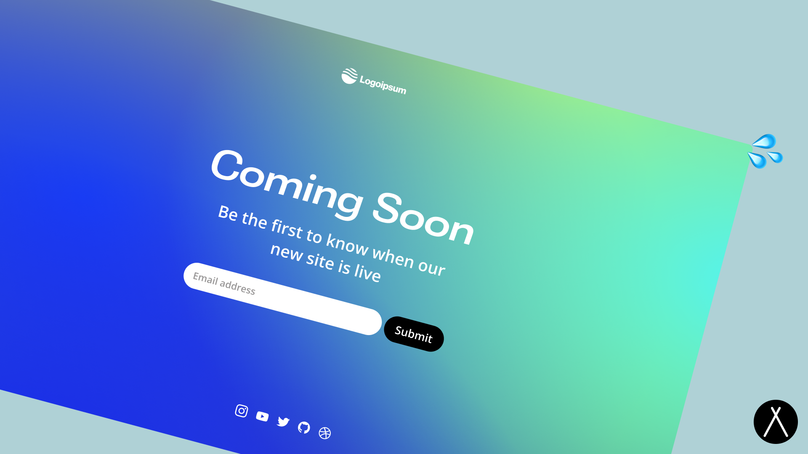

<p align="center">
  
</p>

<br/>
<div align="center">
  <a href="v">
  
</a>
  <a href="">
    
  </a>
  <a href="">
    
  </a>
  
</div>
<br/>

## Get Started 

Customize the global site settings such as the title and description in the `src/data/settings.ts` file

Set your own social profile links and icons in the `src/data/socials.ts` file

<p>.svg
  <a href="">
  
  </a>
</p>

OR

## Local Development

```sh
npm i && npm start
```

## Deploy

Astro has [an in-depth guide](https://docs.astro.build/en/guides/deploy/) on how to deploy an Astro project to each service.

